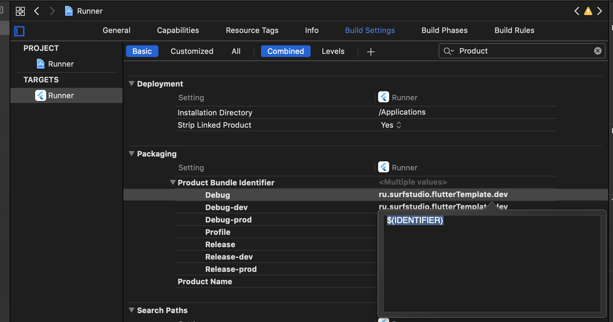
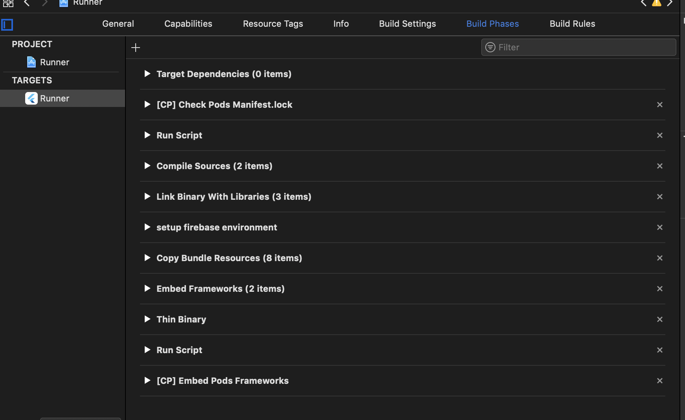

# Организация  Flavors в  Flutter

## Для чего нужны флейворы

Представьте ситуацию: есть приложение с аналитикой. Есть команда разработки, тестировщики, и конечные пользователи. И те и те пользуются одной версией приложения.

Допустим мы хотим проанализировать насколько пользователям интересна фича А. Что в этом случае мы делаем? Идем в аналитику и смотрим сколько было использований данной фичи(например переходов на экран). Но что же мы видим: запредельное число переходов, которое ну никак невозможно с текущей аудиторией, причем все эти переходы были в какой-то определенный отрезок времени. Мы идем дальше и понимаем, что в это время проводились тесты данной фичи. А чуть ранее ее разработка. При этом аналитика также отсылалась.
Итог: аналитика получается грязной и некачественной.

Здесь можно заменить слово аналитика на любое другое: пуш-нотификации, креш-репортинг и etc.

И в этой ситуации нас спасает разделение приложения на две версии отличающиеся минимально, например Bundle ID(package-name). Разработчики и тестеры используют только специальную  dev версию, а пользователи продовую.

Это как раз и есть одна из задач флейворов. Здесь будет использоваться именно flavor так как имеено это название используется Flutter'ом. Вообще люди, знакомые с Android-разработкой думаю сразу узнали этот механизм.

## Flavouring Flutter ?

Хорошо, мы разобрались с задачей. Но как это реализовать? Все ли так просто как много где пишут?

Давайте сразу определимся - организация флейворов - это чисто нативная задача. Сама информация о них не будет доступна из dart кода. Поэтому и за способами организации мы пойдем в нативную мобильную разработку.

### Android

 Здесь все просто. Ничем не отличается от стандартных способов в андроид.
 Конечно может возникнуть вопрос - а почему бы не использовать buildType, но об этом позже.

 Итак, все, что нам потребуется в минимальном варианте:


``` groovy
 flavorDimensions "release-type"

    productFlavors {
        dev {
            dimension "release-type"
            applicationIdSuffix  ".dev"
            versionNameSuffix "-dev"
        }

        prod {
            dimension "release-type"
        }
    }
    
```

И все, теперь мы можем с легкостью запустить команду :

```
flutter run --flavor dev

```

на нашем андроид девайсе.

У некоторых вдумчивых разработчиков может возникнуть вопрос: а почему не buildType? Отвечаю: команда флаттера захардкодила билд тайпы под свои нужды. Собственно, вся магия дебаг сборки в этом и заключается.

### Немного о типах сборок и различных конфигурациях

Итак, мы вспомнили про билд тайпы. Тут надо немного поговорить о них и об их аналогах в IOs.

Можно провести следующее сответствие:

| Android | IOS |
|----------|-----|
| build types | build configurations |
| flavors | targets|

И типы сборок и конфигурации - это скорее нечто влияющее на саму сборку, в идеале не влияющее на кодовую базу или различия в приложениях. (хотя тут вопрос спорный конечно) А вот флейворы и таргеты - это целиком и полностью вполне удобный инструмент для создания двух приложений из одного и настройки отличий версии для разработчиков от версии пользователей.

И все бы было хорошо, и настрваивалось именно так, если бы не одно но...

### Runner - захардкоженный таргет

Как оказалось использовать таргеты для реализации флейворов на стороне айос не представляется возможным. Дело в том, что команда разработчиков Flutter по некоторым причинам подвязалась на это имя. И на этом можно было бы закончить всю работу, казалось бы. 
Но нет. Ведь можно использовать конфигурации сборки.

### IOs

Задача: реализовать две конфигурации(dev , prod, отличающиеся наличием суффикса у версии для разработчиков.

Решение:
1. Создаем две конфигурации
1. В разработческой указываем суффикс
1. Профит!

А теперь разберем все это подробнее.

### Файлы конфигураций

В наших проектах имеется две конфигурации: dev, prod.
Содержимое у них примерно следующее:

```

    #include "Pods/Target Support Files/Pods-Runner/Pods-Runner.debug-dev.xcconfig"
    #include "Generated.xcconfig"
    #include "common.xcconfig"

    bundle_suffix=.dev
    IDENTIFIER=$(identifier)$(bundle_suffix)
```

Как мы видим, в них задается bundle_suffix.

*К слову, кроме этого сам Flutter имеет также конфигурации Release и  Debug. И в них надо также добавить bundle_suffix. (Мы же не хотим, чтобы по умолчанию наша версия была версией для пользователей при запуске из своей любимой IDE).*

Также можно видеть некоторый параметр IDENTIFIER - с ним мы ознакомимся ниже.

Итак, создаем две конфигурации и располоагаем в следующих путях:
```
ios/Flutter/dev.xcconfig
ios/Flutter/prod.xcconfig
```

Создание можно провернуть и через XCode(даже лучше, чтобы они добавились именно как конфигурационные файлы). 
Делается это с помощью **щелчка правкой кнопки по Runner -> New File -> Configuration Settings File -> двльше выбираем место сохранения**.

### Build Configurations. Умножай на два

Теперь разберемся с конфигурациями сборки. Открываем Runner.xcworkspace в Xcode и выбираем представление Project.

Там находим кнопку "+" в разделе Configurations и создаем 4 конфигурации: две для Release и две для Debug - где постфиксом пишем название нашего конфига(и будущей схемы приложения). 

Выглядить это будет примерно так:


К сожалению дублировать конфигураии пока необходимо, так как скрипт ответственный за сборку ios очень чувствителен к неймингу.

### Добавление Scheme

Кроме создания файлов конфигурации необходимо также правильно настроить схемы приложения: их также две.


Из создание крайне просто. Единсвтенный момент - выберите правильный таргет - Runner.

Теперь выберите пункт Edit Scheme и проставьте необходимые конфигурации на каждом из этапов для схем.


### Обновление Info.plist

И последний штрих(спойлер: далеко не последний) - устанавливаем параметр Bundle Identifier в Info.plist как 
```
$(PRODUCT_BUNDLE_IDENTIFIER)$(bundle_suffix)
```

## И вроде бы все...
И вроде бы все сделали, проект запускается, на андроид все вообще круто, но если вы вдруг решили использовать fastlane gym для подписи айос, то у вас это не получится. И вообще айос подпись приложения почему-то не работает... Давайте разберемся.

### No Provisioning Profile

Первая проблема при выгрузке - не найден профайл. Причем в ошибке почему-то выведен не тот идентификатор, что мы указали в конфиге.

Как оказалось это установка идентификатора через Info.plist не срабатывает gym смотрит именно на PRODUCT_BUNDLE_IDENTIFIER, а он у нас одинаковый для всех конфигураций.

Помните загадочный файл common.xcconfig и параметр IDENTIFIER ? Вот как раз они и решают эту проблему.

Создаем еще один конфигурационный файл, в котором мы будем устанавливать по сути базовую часть нашего PRODUCT_BUNDLE_IDENTIFIER.

Содержимое описано одной строкой:
```
identifier=your.bundle.identifier
```

Подключаем этот файл через include в остальные конфиги и устанавливаем новую User Defined переменную IDENTIFIER:
```
#include "common.xcconfig"

IDENTIFIER=$(identifier)$(bundle_suffix)
```

Теперь придется немного поработать мышкой внутри Xcode. Переходим в наш таргет на вкладку Build Settings:


Далее в поиске ищем Product Bundle Identifier(раздел Packaging):


И меняем значение для всех конфигов на:
```
$(IDENTIFIER)
```



Теперь переходим в Info.plist и убираем из строки с идентификатором bundle suffix,  оставляя толькол :
```
$(PRODUCT_BUNFLE_IDENTIFIER)
```

Пробуем собрать и подписать. Все работает как необходимо.

### Разные файлы для разных bundle id

Но мы решили подключить аналитику. Если мы используем файербейз, то нам понадобится два проекта и четыре приложения соответсвенно(2 платформы под две версии).

И что самое главное - нам необходимо иметь два файла google-services.json(Google-Services.Info.plist). На стороне андроид все будет просто: мы создаем папку с названием нашего флейвора и закидываем туда наш файл.

А вот с айос нас ждет крутое приклучение с шелл-скриптами и фазами сборки.

#### Создание и размешения файлов

Первым делом нам необходимо создать в проекте папку где будут эти файлы хранится. Мы используем следующую структуру:


**Важно**: не создаем их через икскод. Они не должны быть привязаны к проекту. Если все же икскод - это ваша любимая IDE, при создании снимите галочки с пугкта Add to target.

Далее располагаем наши файлы в соответствующих папках.

#### Добавление файлов в приложение во время сборки

Так как файлы не привязаны к проекту, в целевой архив они не попадут. А чтобы они все таки тк=уда попали, надо в ручную их туда засунуть.

Доабавим дополнительный этап сборки в виде Run Script (setup firebase как пример названия):
 

Обратите внимание на расположение - оно играет решающюю роль!

Теперь доавим сам скрипт, как один из вариантов можно использовать подобный:

```
 # Name of the resource we're selectively copying
GOOGLESERVICE_INFO_PLIST=GoogleService-Info.plist

# Get references to dev and prod versions of the GoogleService-Info.plist
# NOTE: These should only live on the file system and should NOT be part of the target (since we'll be adding them to the target manually)
GOOGLESERVICE_INFO_DEV=${PROJECT_DIR}/${TARGET_NAME}/Firebase/dev/${GOOGLESERVICE_INFO_PLIST}
GOOGLESERVICE_INFO_PROD=${PROJECT_DIR}/${TARGET_NAME}/Firebase/prod/${GOOGLESERVICE_INFO_PLIST}

# Make sure the dev version of GoogleService-Info.plist exists
echo "Looking for ${GOOGLESERVICE_INFO_PLIST} in ${GOOGLESERVICE_INFO_DEV}"
if [ ! -f $GOOGLESERVICE_INFO_DEV ]
then
echo "No Development GoogleService-Info.plist found. Please ensure it's in the proper directory."
exit 1 # 1
fi

# Make sure the prod version of GoogleService-Info.plist exists
echo "Looking for ${GOOGLESERVICE_INFO_PLIST} in ${GOOGLESERVICE_INFO_PROD}"
if [ ! -f $GOOGLESERVICE_INFO_PROD ]
then
echo "No Production GoogleService-Info.plist found. Please ensure it's in the proper directory."
exit 1 # 1
fi

# Get a reference to the destination location for the GoogleService-Info.plist
PLIST_DESTINATION=${BUILT_PRODUCTS_DIR}/${PRODUCT_NAME}.app
echo "Will copy ${GOOGLESERVICE_INFO_PLIST} to final destination: ${PLIST_DESTINATION}"

# Copy over the prod GoogleService-Info.plist for Release builds
if [[ "${CONFIGURATION}" == *-prod ]]
then
echo "Using ${GOOGLESERVICE_INFO_PROD}"
cp "${GOOGLESERVICE_INFO_PROD}" "${PLIST_DESTINATION}"
else
echo "Using ${GOOGLESERVICE_INFO_DEV}"
cp "${GOOGLESERVICE_INFO_DEV}" "${PLIST_DESTINATION}"
fi
```


## Мысли после

С помощью этих овольно хитрых манипуляций был настроен флейворинг. При этом, я очень надеюсь, что решение временное и в скором времени завезут систему сборки под Flutter(над чем ведутся активные работы).

Но пока мы имеем то, что имеем. И делаем жизнь проще своими руками.


