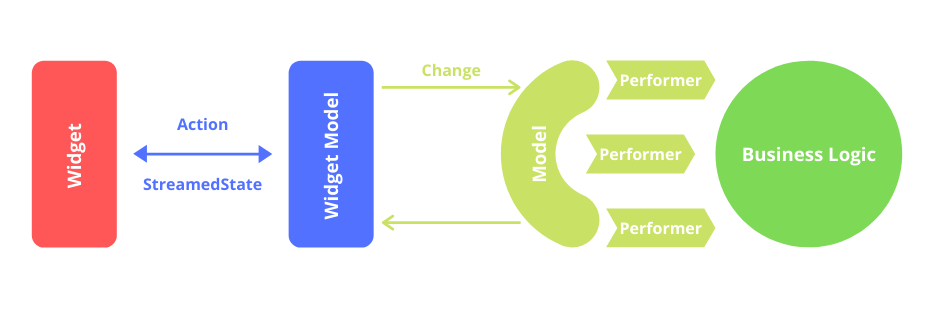

[Главная](../main.md)

Архитектура
===========

В проектах используется собственная архитектура MWWM.
В основе арихитектуры лежат принципы Clean Architecture.

Сама же архитектура представляет собой вариацию *MVVM*.

Можно явно выделить следующие слои: *Widget*, *WidgetModel*, *Model*, *BusinessLogic*.

**Widget** - слой отображения, содержит только декларативную логику. Взаимодействует с WidgetModel посредством *Action* и *StreamedState* (по факту аналог binding в mvvm).

**WidgetModel** - связывает слой виджетов с бизнесс логикой посредством модели. Может содержать логику необходимую для слоя отображения.

**Model** - слой связи WidgetModel с чистой бизнесс-логикой. Является набором контрактов (performer), которые модель может выполнить. Каждый контракт это изолированная атомартая часть бизнесс-логики. WidgetModel инициирует действие с помощью сообщения об изменении (change). Модель ищет соответствующий данному изменению контракт и выполняет его.

**BusinessLogic** - слой бизнесс логики, содержит  чистую логику на dart, совсем не зависит от Flutter.

 

Cлой бизнесс логики обычно содержит сущности следующих типов, каждая из которых имеет свою зону ответственности.

**Интерактор**

Интерактор - сущность, которая реализует логику некоторого бизнес процесса. Интерактор не зависит от платформы, в нем реализуется только логика use case.

**Репозиторий**

Говоря о репозиториях, следует вспомнить паттерн, который собственно так и называется “Репозиторий”. Суть его в том, чтобы создать некий слой абстракции над какими-либо конкретными источниками данных, будь то например база данных или веб-сервис. Задача репозитория стать промежуточным звеном между тем кто запрашивает данные и тем кто их отдает. Важно понимать, что все что находится выше репозитория не должно знать о том, как он устроен и откуда он берет эти данные. Это может быть сетевой запрос, запрос в базу данных или же все вместе, так называемый гибридный запрос, который подразумевает проведение конкатенации запросов на сервер и кеш по некому установленному вами правилу.

**Storage**

Обертка над источником данных. Следуя принципам SOLID, каждый класс должен иметь единственную ответственность.
Нельзя смешивать логику нескольких классов в один. Сущность Storage предназначена для абстрагирования
работы с хранилищем данных. Например есть кейс, когда необходимо сохранять данные пользователя на локальное устройство.
Это необходимо делать в различных форматах. Например xml и json. Правильным решением в этом случае будет
реализовать отдельно низкоуровневое api для работы с файловой системой устройства - FileSystem. Поверх него реализовать
две "обертки" JsonStorage и XmlStorage, которые будут использовать FileSystem для доступа к файловой системе, а логика сохранения
данных будет реализоавана непосредственно в этих классах.

**Mapper**

Объект, который переводит один тип данных в другой.