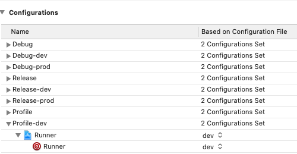
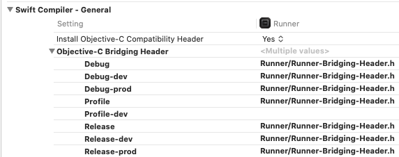

[Main](../main.md)

# Build FAQ

Resolve problems with build types.

If you came here for answers to questions, but have not yet read the [Flavors Organization Guide for Flutter](../best_practice/flavors/flavors_for_devs.md), be sure to read it first.

## Local build of iOS via Fastlane crashes

 - **No profile for team 'XXXXXXXXX' matching. Install the profile (by dragging and dropping it onto Xcode's dock item) or select a different one in the General tab of the target editor.**
     
   The problem was solved by providing extended rights to the directory:
    
   `sudo chmod 755 /Users/{username}/Library/Logs/gym/`
     
 - **Permission denied @ rb_sysopen - /Users/{username}/{project-dir}/ios/{cer-name}.cer**
     
   The problem was solved by providing extended rights to the directory:
    
   `sudo chmod 755 /Users/{username}/{project-dir}/ios/*`

## After removing a package from pubspec.yaml, the build for iOS crashes

 - **ld: framework not found {packageName}.**
     
   The problem is caused because for some reason linker flags are not cleared after 
   removing the package from the project. This must be done manually in Xcode.
    
1. In the `Project navigator` click on the `Runner`;
2. Go to the `Build Settings` tab;
3. In the search, enter the name of the problem package: the search result should 
be in the section `Other Linker Flags`. Expand the list of flags and manually remove the excess from there.
4. Next, push the changes to the git. The build should be repaired.

## I can’t build a profile build for iOS

 - **The required build configuration is missing in Xcode.**
      
    Carefully read the error that occurs in the console during building. 
    It will indicate the name of the Build Configuration that could not be found. 
    You will need to create such a Build Configuration in your project through Xcode.
      
    
      
 - **The profile build crashes when you try to build it under iOS, although the dev build builds successfully.**
      
    If logs appear in the body of the error, most often about the fact that some classes could not be resolved, one of the probable reasons is the lack of value in the Objective-C Bridging Header settings for the Build Configuration you are using. To fix this - just use the same value that is specified in other configurations.
      
    
      