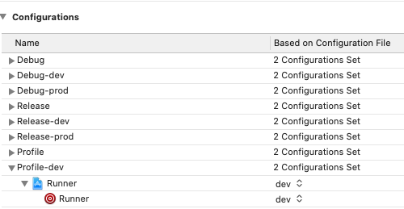
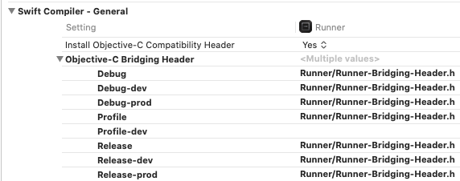

[Главная](../main.md)

# FAQ по типам сборки

Решаем проблемы с типами сборки.

Если вы пришли сюда за ответами на вопросы, но ещё не читали [рукводство по орагнизации Flavors во Flutter](../best_practice/flavors/flavors_long.md) - сначала обязательно прочитайте его.

## Не получается собрать profile-сборку под iOS

 - **Отсутствует нужная Build Configuration в XCode.**
      
    Внимательно читайте ошибку, которая возникает в консоли при сборке.
    В ней будет указано имя Build Configuration, которое не удалось найти.
    Нужно будет создать такую Build Configuration в вашем проекте через
    XCode.
      
    
      
 - **Profile-сборка падает при попытке собрать её под iOS, хотя dev-сборка собирается успешно.**
      
    Если в теле ошибки появляются логи, чаще всего про то, что какие-то
    классы не удалось зарезолвить, одна из вероятных причин -
    отсутствие значения в настройки Objective-C Bridging Header для
    использумой вами Build Configuration. Чтобы пофиксить это - просто
    используйте тоже значение, которое указано у других конфигураций.
      
    
      