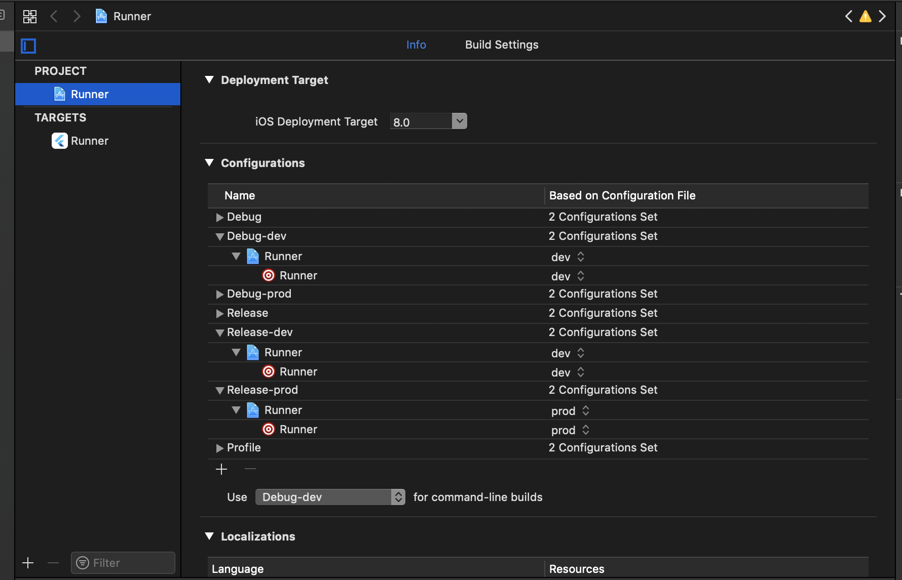
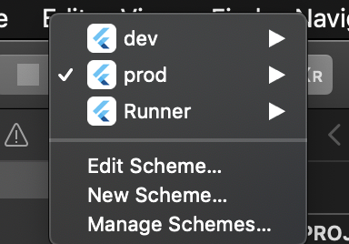
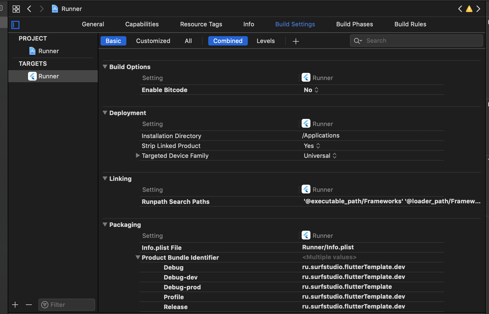
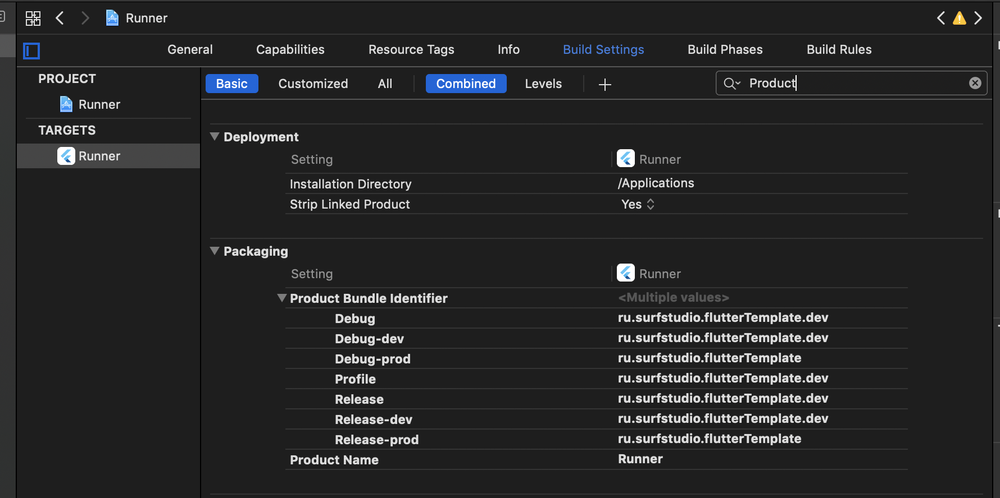
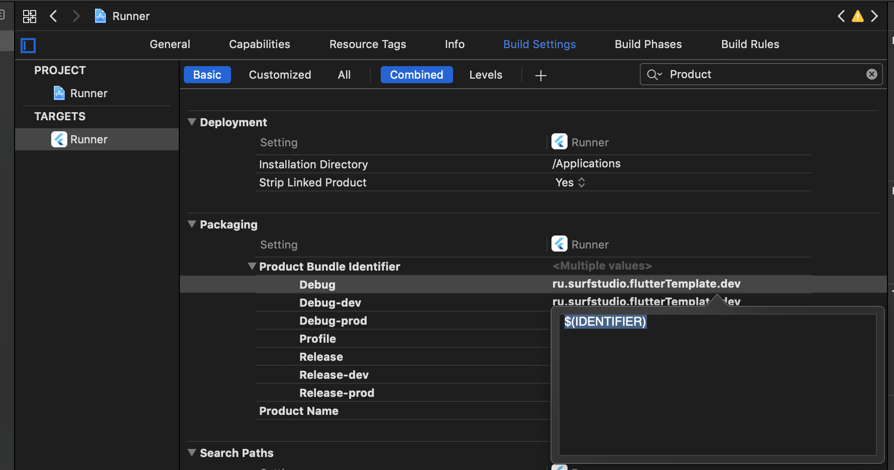
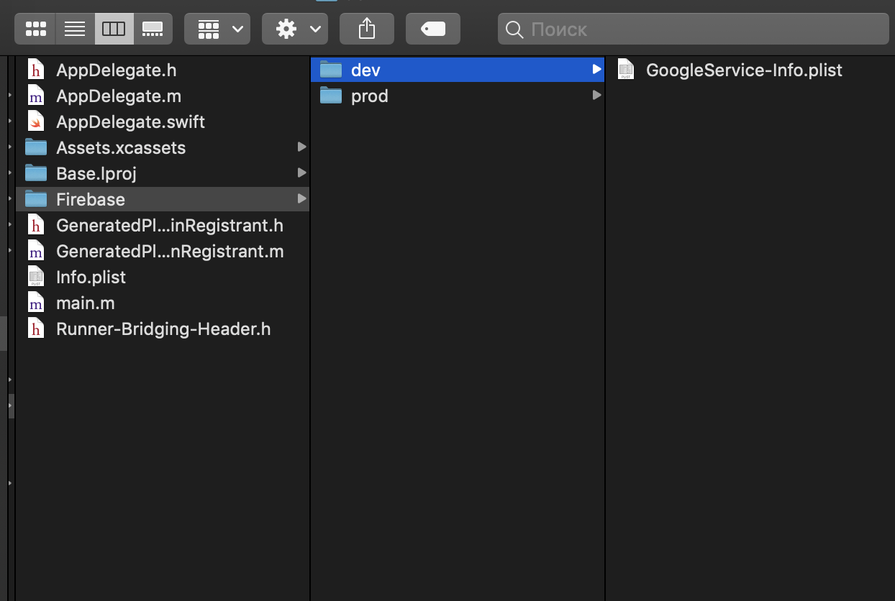
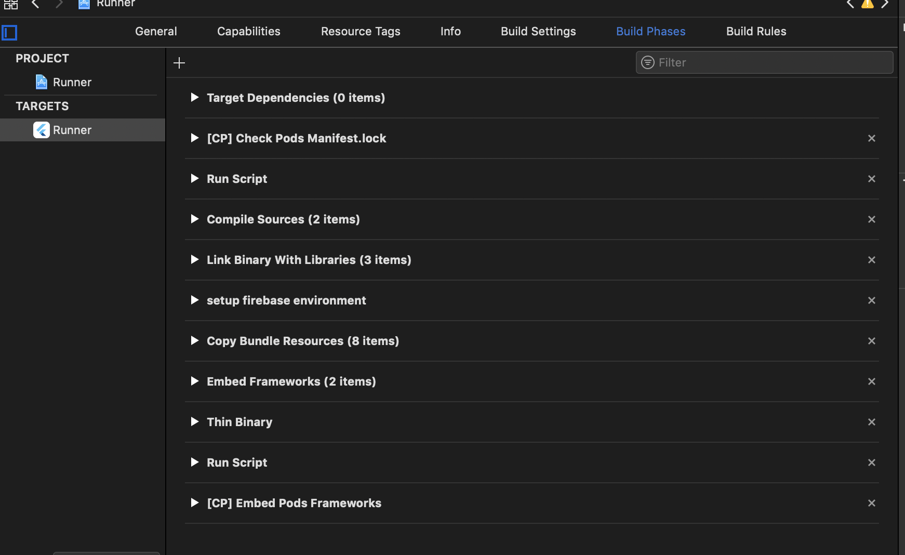

[Главная](../main.md)

# Организация  Flavors в  Flutter

Все шаги ниже уже настроены в [template](../../../../template).

Если Вам необходимо изменить идентификатор под ios - меняйте в файле common.xcconfig.

Информация ниже является сопровождающей. 

### Android

 Здесь все просто. Ничем не отличается от стандартных способов в андроид.

 Итак, все, что нам потребуется в минимальном варианте:

 ```groovy
 flavorDimensions "release-type"

    productFlavors {
        dev {
            dimension "release-type"
            applicationIdSuffix  ".dev"
            versionNameSuffix "-dev"
        }

        prod {
            dimension "release-type"
        }
    }
```

И все, теперь мы можем с легкостью запустить команду :
```
flutter run --flavor dev
```
на нашем андроид девайсе.

### iOS

1. Создаем две конфигурации
1. В разработческой указываем суффикс
1. Профит!


### Файлы конфигураций

В наших проектах имеется две конфигурации: dev, prod.
Содержимое у них примерно следующее:

```с
#include "Pods/Target Support Files/Pods-Runner/Pods-Runner.debug-dev.xcconfig"
#include "Generated.xcconfig"
#include "common.xcconfig"

bundle_suffix=.dev
IDENTIFIER=$(identifier)$(bundle_suffix)
```

Итак, создаем две конфигурации и располоагаем в следующих путях:
```
ios/Flutter/dev.xcconfig
ios/Flutter/prod.xcconfig
```

Создание можно провернуть и через XCode(даже лучше, чтобы они добавились именно как конфигурационные файлы). 
Делается это с помощью **щелчка правкой кнопки по Runner -> New File -> Configuration Settings File -> двльше выбираем место сохранения**.

Создаем еще один конфигурационный файл, в котором мы будем устанавливать по сути базовую часть нашего PRODUCT_BUNDLE_IDENTIFIER.

Содержимое описано одной строкой:
```
identifier=your.bundle.identifier
```

Подключаем этот файл через include в остальные конфиги и устанавливаем новую User Defined переменную IDENTIFIER:
```
#include "common.xcconfig"

IDENTIFIER=$(identifier)$(bundle_suffix)
```

### Build Configurations. Умножай на два

Теперь разберемся с конфигурациями сборки. Открываем Runner.xcworkspace в Xcode и выбираем представление Project.

Там находим кнопку "+" в разделе Configurations и создаем 4 конфигурации: две для Release и две для Debug - где постфиксом пишем название нашего конфига(и будущей схемы приложения). 

Выглядить это будет примерно так:



К сожалению дублировать конфигурации пока необходимо, так как скрипт ответственный за сборку ios очень чувствителен к неймингу.


### Добавление Scheme

Кроме создания файлов конфигурации необходимо также правильно настроить схемы приложения: их также две.



Их создание крайне просто. Единственный момент - выберите правильный таргет - Runner.

Теперь выберите пункт Edit Scheme и проставьте необходимые конфигурации на каждом из этапов для схем.

### Обновление переменных

Теперь придется немного поработать мышкой внутри Xcode. Переходим в наш таргет на вкладку Build Settings:


Далее в поиске ищем Product Bundle Identifier(раздел Packaging):


И меняем значение для всех конфигов на:
```
$(IDENTIFIER)
```



Теперь переходим в Info.plist и убираем из строки с идентификатором bundle suffix,  оставляя толькол :
```
$(PRODUCT_BUNFLE_IDENTIFIER)
```

### Разные файлы для разных bundle id

Но мы решили подключить аналитику. Если мы используем файербейз, то нам понадобится два проекта и четыре приложения соответсвенно(2 платформы под две версии).

И что самое главное - нам необходимо иметь два файла google-services.json(Google-Services.Info.plist). На стороне андроид все будет просто: мы создаем папку с названием нашего флейвора и закидываем туда наш файл.

#### Создание и размешения файлов

Первым делом нам необходимо создать в проекте папку где будут эти файлы хранится. Мы используем следующую структуру:



**Важно**: не создаем их через икскод. Они не должны быть привязаны к проекту. Если все же икскод - это ваша любимая IDE, при создании снимите галочки с пункта Add to target.

Далее располагаем наши файлы в соответствующих папках.

#### Добавление файлов в приложение во время сборки

Так как файлы не привязаны к проекту, в целевой архив они не попадут. А чтобы они все таки тк=уда попали, надо в ручную их туда засунуть.

Доабавим дополнительный этап сборки в виде Run Script (setup firebase как пример названия):
 

 Обратите внимание на расположение - оно играет решающюю роль!

 Теперь доавим сам скрипт, как один из вариантов можно использовать подобный:

 ```
 # Name of the resource we're selectively copying
GOOGLESERVICE_INFO_PLIST=GoogleService-Info.plist

# Get references to dev and prod versions of the GoogleService-Info.plist
# NOTE: These should only live on the file system and should NOT be part of the target (since we'll be adding them to the target manually)
GOOGLESERVICE_INFO_DEV=${PROJECT_DIR}/${TARGET_NAME}/Firebase/dev/${GOOGLESERVICE_INFO_PLIST}
GOOGLESERVICE_INFO_PROD=${PROJECT_DIR}/${TARGET_NAME}/Firebase/prod/${GOOGLESERVICE_INFO_PLIST}

# Make sure the dev version of GoogleService-Info.plist exists
echo "Looking for ${GOOGLESERVICE_INFO_PLIST} in ${GOOGLESERVICE_INFO_DEV}"
if [ ! -f $GOOGLESERVICE_INFO_DEV ]
then
echo "No Development GoogleService-Info.plist found. Please ensure it's in the proper directory."
exit 1 # 1
fi

# Make sure the prod version of GoogleService-Info.plist exists
echo "Looking for ${GOOGLESERVICE_INFO_PLIST} in ${GOOGLESERVICE_INFO_PROD}"
if [ ! -f $GOOGLESERVICE_INFO_PROD ]
then
echo "No Production GoogleService-Info.plist found. Please ensure it's in the proper directory."
exit 1 # 1
fi

# Get a reference to the destination location for the GoogleService-Info.plist
PLIST_DESTINATION=${BUILT_PRODUCTS_DIR}/${PRODUCT_NAME}.app
echo "Will copy ${GOOGLESERVICE_INFO_PLIST} to final destination: ${PLIST_DESTINATION}"

# Copy over the prod GoogleService-Info.plist for Release builds
if [[ "${CONFIGURATION}" == *-prod ]]
then
echo "Using ${GOOGLESERVICE_INFO_PROD}"
cp "${GOOGLESERVICE_INFO_PROD}" "${PLIST_DESTINATION}"
else
echo "Using ${GOOGLESERVICE_INFO_DEV}"
cp "${GOOGLESERVICE_INFO_DEV}" "${PLIST_DESTINATION}"
fi
```


