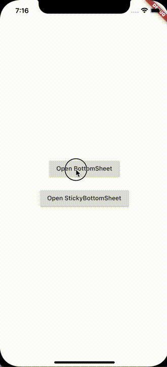
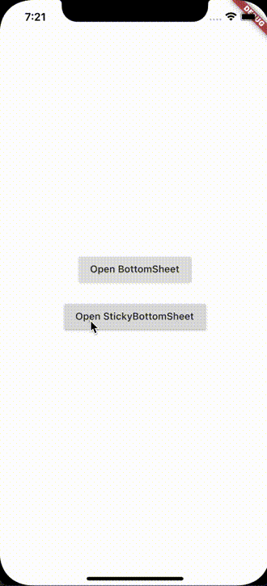

# Bottom Sheet

[](https://github.com/surfstudio/SurfGear/tree/main/packages/bottom_sheet)
[](https://codecov.io/gh/surfstudio/SurfGear)
[](https://pub.dev/packages/bottom_sheet)
[](https://pub.dev/packages/bottom_sheet)
[](https://pub.dev/packages/bottom_sheet/score)


This package is part of the [SurfGear](https://github.com/surfstudio/SurfGear) toolkit made by [Surf](https://surf.ru).

## About

Custom bottom sheet widget, that can resize by drag and then scroll.

## Usage

Main classes:

1. [FlexibleBottomSheetController](lib/src/flexible_bottom_sheet_controller.dart)
2. [FlexibleBottomSheetOwner](lib/src/flexible_bottom_sheet_owner.dart)
3. [BottomSheetRoute and Showing methods](lib/src/flexible_bottom_sheet_route.dart)

Flexible and scrollable bottom sheet.

You can show it if call `showFlexibleBottomSheet()`, then it will be show as popup like a modal bottom sheet with resize by drag and scrollable.

Also you can use `FlexibleBottomSheetController` to show it. For this call you must create `FlexibleBottomSheetController` and give to controller.

There are 2 type of BottomSheet:  

1. BottomSheet
2. StickyBottomSheet

#### Simple BottomSheet



To show bottomSheet, use :

```dart
showFlexibleBottomSheet(
  minHeight: 0,
  initHeight: 0.5,
  maxHeight: 1,
  context: context,
  builder: _buildBottomSheet,
  anchors: [0, 0.5, 1],
);

Widget _buildBottomSheet(
    BuildContext context,
    ScrollController scrollController,
    double bottomSheetOffset,
  ) {
    return SafeArea(
      child: Material(
        child: Container(
          child: ListView(
            ...
          ),
        ),
      ),
    );
  }
```

#### Sticky BottomSheet



To show sticky BottomSheet, use:  
**You should return SliverChildListDelegate from builder !!!**

```dart
showStickyFlexibleBottomSheet(
      minHeight: 0,
      initHeight: 0.5,
      maxHeight: 1,
      headerHeight: 200,
      context: context,
      backgroundColor: Colors.white,
      headerBuilder: (BuildContext context, double offset) {
        return Container(
          ...
        );
      },
      builder: (BuildContext context, double offset) {
        return SliverChildListDelegate(
          <Widget>[...],
        );
      },
      anchors: [0, 0.5, 1],
    );
```

## Installation

Add `bottom_sheet` to your `pubspec.yaml` file:

```yaml
dependencies:
  bottom_sheet: ^1.0.0
```

You can use both `stable` and `dev` versions of the package listed above in the badges bar.

## Changelog

All notable changes to this project will be documented in [this file](./CHANGELOG.md).

## Issues

For issues, file directly in the [main SurfGear repo](https://github.com/surfstudio/SurfGear).

## Contribute

If you would like to contribute to the package (e.g. by improving the documentation, solving a bug or adding a cool new feature), please review our [contribution guide](../../CONTRIBUTING.md) first and send us your pull request.

Your PRs are always welcome.

## How to reach us

Please feel free to ask any questions about this package. Join our community chat on Telegram. We speak English and Russian.

[](https://t.me/SurfGear)

## License

[Apache License, Version 2.0](https://www.apache.org/licenses/LICENSE-2.0)
