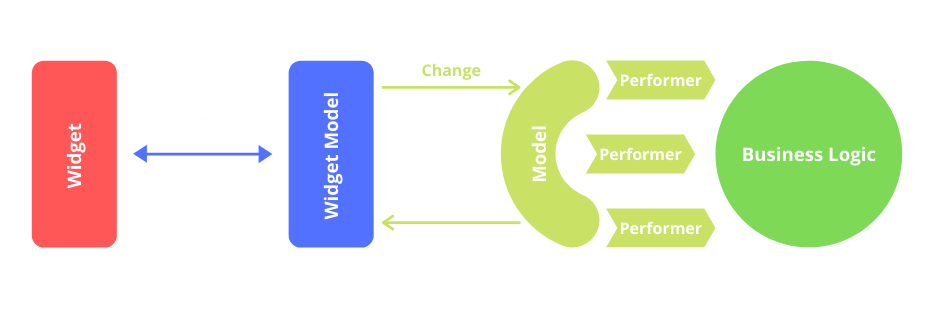

<!---->

# 

Software architectural pattern for Flutter apps.

## Description

MWWM is based on principles of Clean Architecture and is a variation of *MVVM*.

It consists of three parts: *Widget*, *WidgetModel* and *Model*.

**Widget** — a representation layer that contains only UI related code. 

**WidgetModel** - handles and accumulates all data needed for Widget:
objects of the domain layer, scroll position, text fields values, animation state, etc.
WidgetModel uses Model for interaction with various data sources.

**Model** - a link between WidgetModel and "the external world": data sources,
services or other abstraction layers. It allows to develop both separately and have
a possibility to modify one layer with no need for changing the other. Model is
represented by two components: **Change** (a signal to model which means *what* we want
to achieve) and **Performer** (that knows *how* to achieve it).

 

## Why?

This architecture completely separates design and logic. Adds the ability to work on independent layers by different developers. Adds autonomy to work, like HTML and CSS.

##  How to use

1. Create widget which extends `CoreMwwmWidget`
```
class CounterScreen extends CoreMwwmWidget {
  CounterScreen()
      : super(
            //...
          ),
          widgetStateBuilder: //... ,
        );
}
```
2. Create State for this widget which extends `WidgetState`
```
class _CounterScreenState extends WidgetState<CounterWidgetModel> {
  @override
  Widget build(BuildContext context) {
    return Scaffold(
      body: //... ,
    );
  }
}
```
3. Define `widgetStateBuilder` for your widget in `super`. 
```
super(
          // ...
          widgetStateBuilder: () => _CounterScreenState(),
        );
``` 
4. Create WidgetModel by extending `WidgetModel` class and provide here `ErrorHandler` and `Model`
