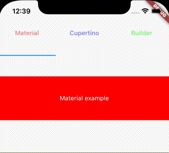
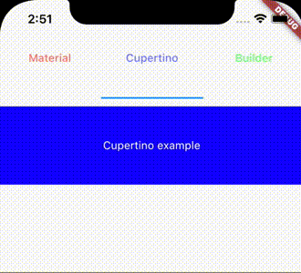

# Swipe Refresh

[](https://github.com/surfstudio/SurfGear)
[](https://codecov.io/gh/surfstudio/SurfGear)
[](https://pub.dev/packages/swipe_refresh)
[](https://pub.dev/packages/swipe_refresh)
[](https://pub.dev/packages/swipe_refresh)


This package is part of the [SurfGear](https://github.com/surfstudio/SurfGear) toolkit made by [Surf](https://surf.ru).

## About

Widget for refresh by swipe.




## Usage

Main classes:

1. [Refresh state](lib/src/swipe_refresh_state.dart)
2. [Widget for indicate swipe refresh](lib/src/swipe_refresh.dart)
3. [Widget for indicate swipe refresh Material style](lib/src/material_swipe_refresh.dart)
4. [Widget for indicate swipe refresh Cupertino style](lib/src/cupertino_swipe_refresh.dart)

## Installation

Add `swipe_refresh` to your `pubspec.yaml` file:

```yaml
dependencies:
  swipe_refresh: ^1.0.0
```

You can use both `stable` and `dev` versions of the package listed above in the badges bar.

## Changelog

All notable changes to this project will be documented in [this file](./CHANGELOG.md).

## Issues

For issues, file directly in the [main SurfGear repo](https://github.com/surfstudio/SurfGear).

## Contribute

If you would like to contribute to the package (e.g. by improving the documentation, solving a bug or adding a cool new feature), please review our [contribution guide](../../CONTRIBUTING.md) first and send us your pull request.

You PRs are always welcome.

## How to reach us

Please feel free to ask any questions about this package. Join our community chat on Telegram. We speak English and Russian.

[](https://t.me/SurfGear)

## License

[Apache License, Version 2.0](https://www.apache.org/licenses/LICENSE-2.0)
